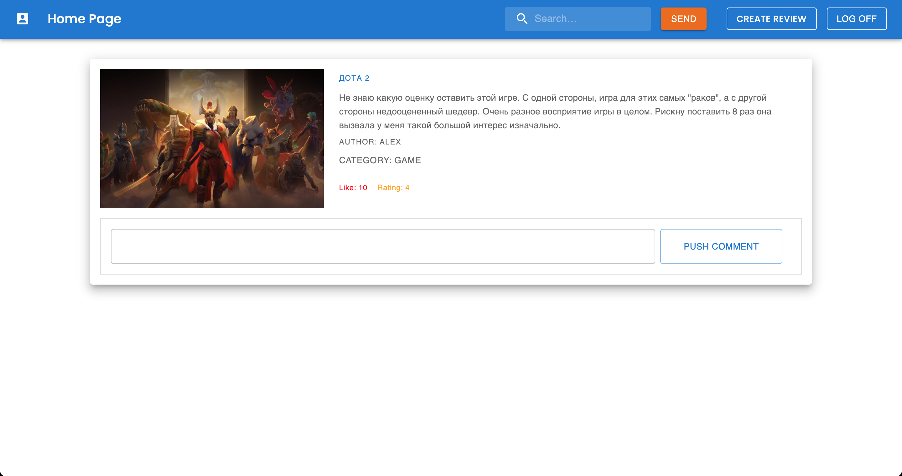
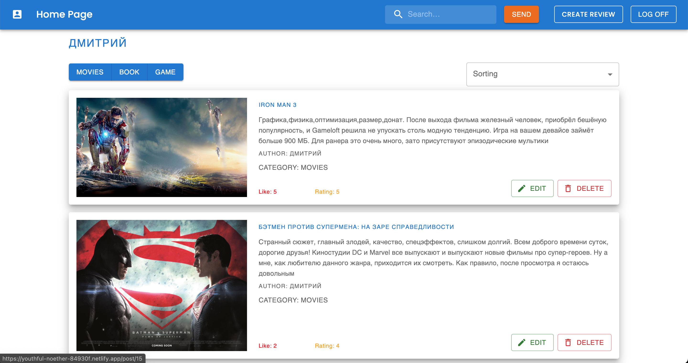

### Front-end:

- `material-ui`
- `react`
- `react-router-dom`
- `axios`
- `react-content-loader`
- `cloudinary-react`
- `react-hook-form`

### Back-end:

- `body-parser`
- `cors`
- `express`
- `mysql`
- `nodemon`

